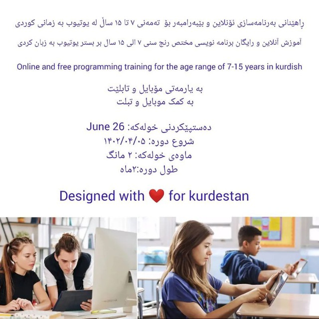

# Kids7-15Course
Free programming training for children 7-15 years old in Kurdish  

# Table of conntent: (title and youtube link) 

<table>
  <tr>
    <th>Rows</th>
    <th>English</th>
    <th>کوردی</th>
     <th>فارسی</th>
 <th>Youtube</th>
  </tr>
  <tr>
    <td>1</td>
    <td>Tynker visual programming language </td>
    <td>بەرنامەسازی منداڵان لەگەڵ Tynker </td>
        <td>برنامه نویسی کودکان با Tynker</td>
    <td>https://youtu.be/mYTeT43bNHg</td>
  </tr>
  <tr>
    <td>2</td>
    <td>Install on android</td>
    <td>دامەزراندن لەAndroid </td>
     <td>نصب بر روی Android</td>
     <td>https://youtu.be/icyR9zCQrgo</td>
  </tr>

  <tr>
    <td>3</td>
    <td>Install on ios</td>
    <td>دامەزراندنی لەسەر IOS </td>
     <td>نصب بر روی IOS</td>
     <td>https://youtu.be/4kJvKFQog4g</td>
  </tr>

<tr>
    <td>4</td>
    <td>First app</td>
    <td>یەکەم ئەپی تۆ </td>
     <td>اولین برنامه شما</td>
     <td>https://youtu.be/VOJOR-FjxT4</td>
  </tr>

  <tr>
    <td>5</td>
    <td>Animations</td>
    <td>ئەنیمەیشنەکان</td>
     <td>اانیمیشن ها </td>
     <td>https://youtu.be/7CWDvbcoRiU</td>
  </tr>
  
  <tr>
    <td>6</td>
    <td>Brodcast message to actors</td>
    <td>پەخشکردن و ناردنی نامە </td>
     <td>پخش کردن و ارسال پیغام ها </td>
     <td>https://youtu.be/ZuI5tbyzpmM</td>
  </tr>

    <tr>
    <td>7</td>
    <td>Conversation</td>
    <td>گفتوگۆ </td>
     <td>مکالمه</td>
     <td>https://youtu.be/MxQFOLtmCDU</td> 
     </tr>

  

  
</table>

7-Conversation
 
گفتوگۆ 
 
مکالمه
https://youtu.be/MxQFOLtmCDU
 
8-Touch other actors
 
دەست لێدان لە کارەکتەرەکان 
 
لمس کردن کاراکترها 

https://youtu.be/ygpXC3AxJxA

9-Draw shape and text
 
شێوە و دەق بکێشە 
کشیدن اشکال و متن
https://youtu.be/t9VEn4a0K4M
 
10-Get input
 
وەرگرتنی زانیاری 
گرفتن ورودی 
 

https://youtu.be/BDM70EQdw-U
 
11-Single choice input
https://youtu.be/t2Dsd1Lzhxk

12-Variable
https://youtu.be/Fqk5GGOvUEU

13-Function and join text
https://youtu.be/3mGDNjie7gQ

14-Play a sound
https://youtu.be/EgUQoNt8AtE

15-Random Position
https://youtu.be/UbAdodAi6pA

